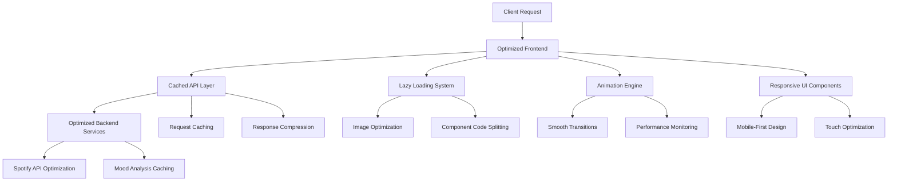

# Design Document

## Overview

This design document outlines comprehensive optimization strategies for the MoodTunes application to address performance bottlenecks, improve user experience, and ensure robust error handling. The optimizations focus on reducing latency, implementing efficient lazy loading, enhancing responsiveness, adding smooth animations, fixing UI issues, and implementing comprehensive testing strategies.

## Architecture

### Performance Optimization Strategy



### Technology Stack Enhancements

**Frontend Optimizations:**

- Next.js 15.5.2 with App Router optimizations
- React 19.1.1 with Concurrent Features
- Framer Motion 12.23.12 for optimized animations
- Next/Image for automatic image optimization
- React.lazy() and Suspense for code splitting

**Performance Monitoring:**

- Web Vitals tracking
- Performance API integration
- Error boundary implementation
- Loading state management

**Caching Strategy:**

- Browser caching for static assets
- API response caching with SWR/React Query
- Service Worker for offline functionality
- Local Storage optimization

## Components and Interfaces

### 1. Performance Monitoring System

#### PerformanceMonitor Component

```javascript
// PerformanceMetrics object structure
const performanceMetrics = {
  loadTime: 0,
  renderTime: 0,
  apiResponseTime: 0,
  animationFPS: 0,
};

// PerformanceMonitor component props
const performanceMonitorProps = {
  onMetricsUpdate: (metrics) => {},
  enableReporting: true,
};
```

**Responsibilities:**

- Track Core Web Vitals (LCP, FID, CLS)
- Monitor API response times
- Measure animation performance
- Report performance bottlenecks

#### LoadingStateManager

```javascript
// LoadingState object structure
const loadingState = {
  isLoading: false,
  progress: 0,
  message: "",
  estimatedTime: 0,
};

// LoadingStateManager props
const loadingStateManagerProps = {
  states: {},
  globalLoading: false,
};
```

### 2. Optimized Image System

#### LazyImage Component

```javascript
// LazyImage component props
const lazyImageProps = {
  src: "",
  alt: "",
  width: 0,
  height: 0,
  priority: false,
  placeholder: "blur", // 'blur' | 'empty'
  blurDataURL: "",
  sizes: "",
  onLoad: () => {},
  onError: () => {},
};
```

**Features:**

- Automatic WebP/AVIF format selection
- Responsive image sizing
- Intersection Observer for lazy loading
- Blur placeholder generation
- Error fallback handling

### 3. Enhanced Animation System

#### AnimationProvider

```javascript
// Animation configuration object
const animationConfig = {
  reducedMotion: false,
  performanceMode: "high", // 'high' | 'medium' | 'low'
  enableGPUAcceleration: true,
};

// AnimationProvider props
const animationProviderProps = {
  config: animationConfig,
  children: null,
};
```

#### OptimizedTransition Component

```javascript
// Transition component props
const transitionProps = {
  children: null,
  type: "fade", // 'fade' | 'slide' | 'scale' | 'custom'
  duration: 300,
  easing: "ease-in-out",
  delay: 0,
  onComplete: () => {},
};
```

### 4. Responsive Navigation System

#### OptimizedNavbar Component

```javascript
// Navbar state object
const navbarState = {
  isScrolled: false,
  isMobileMenuOpen: false,
  isResizing: false,
  viewportWidth: 0,
};

// Navbar props
const navbarProps = {
  items: [],
  logo: null,
  actions: null,
  sticky: true,
  transparent: false,
};
```

**Optimizations:**

- Debounced scroll listeners
- Smooth resize transitions
- Touch-optimized mobile menu
- Reduced layout shifts

### 5. Authentication Flow Enhancement

#### AuthGuard Component

```javascript
// AuthGuard props
const authGuardProps = {
  children: null,
  fallback: null,
  redirectTo: "/sign-in",
  showToast: true,
  toastMessage: "Please sign in to continue",
};

// Auth state object
const authState = {
  isAuthenticated: false,
  isLoading: false,
  user: null,
  error: null,
};
```

## Error Handling

### Enhanced Error Boundary System

#### GlobalErrorBoundary

```javascript
// Error info object
const errorInfo = {
  componentStack: "",
  errorBoundary: "",
  eventType: "",
};

// Error boundary state
const errorBoundaryState = {
  hasError: false,
  error: null,
  errorInfo: null,
  errorId: "",
};
```

#### API Error Handling

```javascript
// API Error object
const apiError = {
  message: "",
  code: "",
  statusCode: 0,
  retryable: false,
  context: {},
};

// Retry configuration
const retryConfig = {
  maxRetries: 3,
  backoffMultiplier: 2,
  initialDelay: 1000,
  maxDelay: 10000,
};
```

### Toast Notification System

```javascript
// Toast configuration
const toastConfig = {
  type: "success", // 'success' | 'error' | 'warning' | 'info'
  message: "",
  duration: 5000,
  action: {
    label: "",
    onClick: () => {},
  },
  persistent: false,
};

// Toast manager methods
const toastManager = {
  show: (config) => {},
  dismiss: (id) => {},
  dismissAll: () => {},
  update: (id, config) => {},
};
```

## Testing Strategy

### Performance Testing Framework

#### Core Web Vitals Testing

```javascript
// Performance test configuration
const performanceTest = {
  name: "",
  url: "",
  device: "mobile", // 'mobile' | 'desktop'
  network: "4g", // '3g' | '4g' | 'wifi'
  expectedMetrics: {
    lcp: 2500,
    fid: 100,
    cls: 0.1,
  },
};
```

### Component Testing Strategy

#### Visual Regression Testing

```javascript
// Visual test configuration
const visualTest = {
  component: "Navbar",
  variants: [
    {
      name: "default",
      props: {},
      viewport: { width: 1280, height: 720 },
    },
    {
      name: "mobile",
      props: {},
      viewport: { width: 375, height: 667 },
    },
  ],
  threshold: 0.2,
};
```

## Implementation Considerations

### Performance Optimization Strategies

#### 1. Bundle Optimization

- **Code Splitting**: Implement route-based and component-based code splitting
- **Tree Shaking**: Remove unused code from bundles
- **Dynamic Imports**: Load components only when needed
- **Bundle Analysis**: Regular analysis of bundle size and composition

#### 2. Image Optimization Pipeline

```javascript
const imageOptimizationConfig = {
  formats: ["webp", "avif", "jpeg"],
  sizes: [320, 640, 768, 1024, 1280, 1920],
  quality: {
    webp: 80,
    avif: 70,
    jpeg: 85,
  },
  placeholder: {
    blur: true,
    color: "#f3f4f6",
  },
};
```

#### 3. API Optimization

- **Request Deduplication**: Prevent duplicate API calls
- **Response Caching**: Cache API responses with appropriate TTL
- **Request Batching**: Combine multiple requests where possible
- **Compression**: Enable gzip/brotli compression

### Animation Performance

#### GPU Acceleration Strategy

```css
.optimized-animation {
  will-change: transform, opacity;
  transform: translateZ(0); /* Force GPU layer */
  backface-visibility: hidden;
}
```

### Responsive Design Implementation

#### Breakpoint System

```javascript
const breakpoints = {
  xs: "0px",
  sm: "640px",
  md: "768px",
  lg: "1024px",
  xl: "1280px",
  "2xl": "1536px",
};

const mediaQueries = {
  xs: `(min-width: ${breakpoints.xs})`,
  sm: `(min-width: ${breakpoints.sm})`,
  md: `(min-width: ${breakpoints.md})`,
  lg: `(min-width: ${breakpoints.lg})`,
  xl: `(min-width: ${breakpoints.xl})`,
  "2xl": `(min-width: ${breakpoints["2xl"]})`,
};
```

#### Touch Optimization

```javascript
const touchConfig = {
  minTouchTarget: 44, // pixels
  tapHighlight: false,
  scrollBehavior: "smooth",
  overscrollBehavior: "contain",
};
```

### Security Considerations

#### Content Security Policy

```javascript
const cspConfig = {
  "default-src": ["'self'"],
  "script-src": ["'self'", "'unsafe-inline'", "https://open.spotify.com"],
  "style-src": ["'self'", "'unsafe-inline'"],
  "img-src": ["'self'", "data:", "https:"],
  "connect-src": ["'self'", "https://api.spotify.com"],
  "frame-src": ["https://open.spotify.com"],
};
```

### Monitoring and Analytics

#### Performance Monitoring Setup

```javascript
const performanceConfig = {
  enableWebVitals: true,
  enableUserTiming: true,
  enableResourceTiming: true,
  sampleRate: 0.1, // 10% sampling
  reportingEndpoint: "/api/analytics/performance",
};
```

#### Error Tracking Configuration

```javascript
const errorTrackingConfig = {
  enableErrorBoundaries: true,
  enableUnhandledRejection: true,
  enableConsoleErrors: true,
  maxErrorsPerSession: 50,
  reportingEndpoint: "/api/analytics/errors",
};
```
