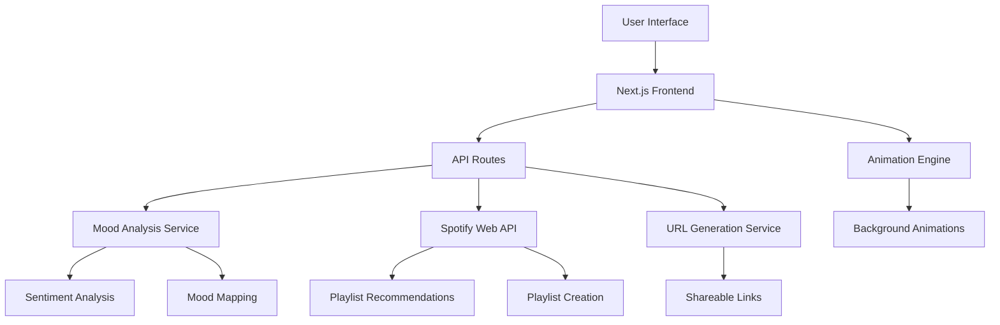

# Design Document

## Overview

The Mood-to-Playlist Generator is built as a Next.js web application that combines natural language processing, Spotify API integration, and dynamic visual animations to create an immersive music discovery experience. The application follows a client-server architecture with API routes handling external service integrations and the frontend providing an interactive, responsive user interface.

## Architecture

### High-Level Architecture



### Technology Stack

- **Frontend**: Next.js 15.5.2 with React 19.1.0
- **Styling**: Tailwind CSS 4 with custom animations
- **UI Components**: Lucide React icons, ShadCN components
- **Animation**: CSS animations with Tailwind, potentially Framer Motion for complex animations
- **API Integration**: Next.js API routes for server-side operations
- **External APIs**: Spotify Web API, optional OpenAI/HuggingFace for advanced mood analysis

## Components and Interfaces

### Frontend Components

#### 1. MoodInput Component

```javascript
// Handles user mood input with validation
interface MoodInputProps {
  onSubmit: (mood: string) => void;
  isLoading: boolean;
}
```

**Responsibilities:**

- Render input field with placeholder text
- Validate input length and content
- Handle form submission
- Display loading states

#### 2. PlaylistDisplay Component

```javascript
// Displays Spotify playlist embed
interface PlaylistDisplayProps {
  playlistId: string;
  mood: string;
  isLoading: boolean;
}
```

**Responsibilities:**

- Embed Spotify playlist iframe
- Handle playlist loading states
- Display mood context information
- Provide share functionality

#### 3. DynamicBackground Component

```javascript
// Renders mood-based animated backgrounds
interface DynamicBackgroundProps {
  mood: MoodCategory;
  intensity: number;
}
```

**Responsibilities:**

- Generate CSS animations based on mood
- Manage animation performance
- Provide smooth transitions between moods
- Ensure accessibility compliance

#### 4. ShareModal Component

```javascript
// Handles playlist sharing functionality
interface ShareModalProps {
  shareUrl: string;
  mood: string;
  onClose: () => void;
}
```

**Responsibilities:**

- Generate shareable URLs
- Provide social media sharing options
- Copy link to clipboard functionality
- Display social media previews

### Backend API Routes

#### 1. /api/analyze-mood

```javascript
// POST endpoint for mood analysis
interface MoodAnalysisRequest {
  moodText: string;
}

interface MoodAnalysisResponse {
  mood: MoodCategory;
  confidence: number;
  genres: string[];
  energy: number;
  valence: number;
}
```

#### 2. /api/generate-playlist

```javascript
// POST endpoint for Spotify playlist generation
interface PlaylistRequest {
  mood: MoodCategory;
  genres: string[];
  energy: number;
  valence: number;
}

interface PlaylistResponse {
  playlistId: string;
  tracks: Track[];
  shareUrl: string;
}
```

#### 3. /api/share/[id]

```javascript
// GET endpoint for shared playlist retrieval
interface SharedPlaylistResponse {
  mood: string;
  playlistId: string;
  backgroundTheme: string;
  createdAt: string;
}
```

## Data Models

### MoodCategory Enum

```javascript
enum MoodCategory {
  HAPPY = 'happy',
  SAD = 'sad',
  ENERGETIC = 'energetic',
  CALM = 'calm',
  ANXIOUS = 'anxious',
  ROMANTIC = 'romantic',
  NOSTALGIC = 'nostalgic',
  ANGRY = 'angry'
}
```

### MoodMapping Interface

```javascript
interface MoodMapping {
  category: MoodCategory;
  genres: string[];
  energy: number; // 0.0 - 1.0
  valence: number; // 0.0 - 1.0
  tempo: {
    min: number,
    max: number,
  };
  backgroundTheme: BackgroundTheme;
}
```

### BackgroundTheme Interface

```javascript
interface BackgroundTheme {
  colors: {
    primary: string,
    secondary: string,
    accent: string,
  };
  animation: {
    type: "waves" | "particles" | "gradient" | "shapes",
    speed: "slow" | "medium" | "fast",
    intensity: number,
  };
}
```

### Spotify Integration Models

```javascript
interface SpotifyTrack {
  id: string;
  name: string;
  artists: string[];
  preview_url: string;
  external_urls: {
    spotify: string,
  };
}

interface SpotifyPlaylist {
  id: string;
  name: string;
  description: string;
  tracks: SpotifyTrack[];
  external_urls: {
    spotify: string,
  };
}
```

## Error Handling

### Error Types and Responses

#### 1. Mood Analysis Errors

```javascript
class MoodAnalysisError extends Error {
  constructor(message, fallbackMood) {
    super(message);
    this.fallbackMood = fallbackMood;
    this.name = "MoodAnalysisError";
  }
}
```

#### 2. Spotify API Errors

```javascript
class SpotifyAPIError extends Error {
  constructor(message, statusCode, retryable = false) {
    super(message);
    this.statusCode = statusCode;
    this.retryable = retryable;
    this.name = "SpotifyAPIError";
  }
}
```

### Error Handling Strategy

1. **Client-Side Error Boundaries**: React error boundaries to catch and display user-friendly error messages
2. **API Error Responses**: Standardized error response format with error codes and user messages
3. **Fallback Mechanisms**: Default mood mappings when analysis fails, popular playlists when recommendations fail
4. **Retry Logic**: Exponential backoff for transient API failures
5. **Logging**: Comprehensive error logging for debugging and monitoring

## Testing Strategy

### Unit Testing

- **Mood Analysis Logic**: Test mood categorization and mapping functions
- **Component Rendering**: Test React components with various props and states
- **API Route Handlers**: Test request/response handling and error scenarios
- **Utility Functions**: Test helper functions for URL generation, validation, etc.

### Integration Testing

- **Spotify API Integration**: Test playlist generation with mock and real API responses
- **End-to-End User Flows**: Test complete user journey from mood input to playlist sharing
- **Error Scenarios**: Test graceful degradation when external services fail

### Performance Testing

- **Animation Performance**: Ensure 60fps animations on target devices
- **API Response Times**: Verify playlist generation completes within 10 seconds
- **Load Testing**: Test concurrent user scenarios and rate limiting

### Accessibility Testing

- **Screen Reader Compatibility**: Ensure all interactive elements are accessible
- **Keyboard Navigation**: Test complete functionality without mouse
- **Color Contrast**: Verify sufficient contrast ratios for all text and UI elements
- **Motion Sensitivity**: Provide options to reduce animations for users with vestibular disorders

## Implementation Considerations

### Spotify API Integration

- **Authentication**: Use Spotify Client Credentials flow for app-only access
- **Rate Limiting**: Implement request throttling to stay within API limits
- **Caching**: Cache popular recommendations to reduce API calls
- **Playlist Management**: Create temporary playlists or use recommendation endpoint directly

### Mood Analysis Approaches

1. **Simple Keyword Matching**: Fast, reliable fallback using predefined mood keywords
2. **Sentiment Analysis Library**: Use libraries like `sentiment` or `vader-sentiment` for basic analysis
3. **Advanced NLP**: Optional integration with OpenAI or HuggingFace for sophisticated mood detection

### Performance Optimizations

- **Code Splitting**: Lazy load animation components and heavy dependencies
- **Image Optimization**: Use Next.js Image component for any visual assets
- **API Caching**: Implement Redis or in-memory caching for frequent requests
- **CDN Integration**: Serve static assets through CDN for global performance

### Security Considerations

- **API Key Management**: Store Spotify credentials securely using environment variables
- **Input Validation**: Sanitize and validate all user inputs
- **Rate Limiting**: Implement per-user rate limiting to prevent abuse
- **CORS Configuration**: Properly configure CORS for API endpoints
- **Content Security Policy**: Implement CSP headers to prevent XSS attacks
