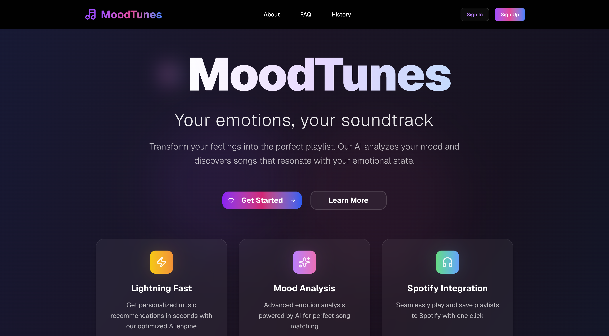

# MoodTunes - Mood Music Recommendations



Transform your feelings into the perfect soundtrack. MoodTunes uses advanced mood analysis to understand your emotional state and recommends personalized songs from Spotify that perfectly match how you're feeling.

## LINKS

<div align="center">

[](https://youtu.be/RUkqsLs97gU)

**Live Site:** [moodtunes.zeropse.org](https://moodtunes.zeropse.org)

</div>

## ✨ Features

### 🧠 Advanced Mood Analysis

- **Sophisticated Mood Detection**: 10+ mood categories with 200+ keywords and contextual understanding
- **Sentiment Analysis**: Multi-layered emotion processing with confidence scoring
- **Contextual Understanding**: Handles negation, intensity, temporal context, and complex emotions
- **Edge Case Handling**: Processes mixed emotions, contradictions, and poetic language

### 🎵 Intelligent Music Matching

- **Musical Parameter Mapping**: Converts emotions to energy, valence, tempo, and genre preferences
- **Smart Duplicate Prevention**: Generates fresh suggestions for repeated moods using 6 search strategies
- **Multi-Genre Search**: Up to 5 genres per mood with intelligent track curation
- **Fallback System**: 10 sample tracks when Spotify API is unavailable

### 🎨 Premium Visual Experience

- **Dynamic Vortex Background**: 700+ animated particles with Simplex noise generation
- **Smooth Animations**: Hardware-accelerated transitions with reduced motion support
- **Loading States**: Multiple spinner variants (spinner, dots, wave, bouncing balls)
- **Page Transitions**: 7 animation types (fade, slide, scale, blur) with customizable timing

### 🔗 Seamless Integrations

- **Spotify Web API**: Direct song playback with album art and metadata
- **Clerk Authentication**: Secure user management with social login options
- **Sharing System**: Create shareable mood links via JSONBin.io storage
- **History Tracking**: Local storage of last 3 mood analyses with detailed views

### 🚀 Performance & Reliability

- **API Caching**: 30-minute Spotify response caching with rate limiting
- **Error Handling**: Comprehensive retry logic with exponential backoff
- **Circuit Breakers**: Prevents cascade failures with automatic recovery
- **Input Validation**: XSS protection, sanitization, and comprehensive edge case handling

### ♿ Accessibility & UX

- **WCAG Compliant**: Full keyboard navigation and screen reader support
- **Responsive Design**: Mobile-first approach with touch optimization
- **Dark/Light Themes**: System preference detection with manual toggle
- **Progressive Enhancement**: Core functionality works without JavaScript

### Prerequisites

- **Node.js 18+** and pnpm/npm
- **Spotify Developer Account** (for music API access)
- **Clerk Account** (for user authentication)
- **JSONBin.io Account** (optional, for sharing feature)

## 🛠️ Technology Stack

### Core Framework & Build

- **Framework**: Next.js 15.5.3 with Turbopack for ultra-fast development and builds
- **Runtime**: React 19.1.1 with modern concurrent features
- **Build System**: Turbopack for 10x faster builds and hot module replacement
- **Package Manager**: pnpm for efficient dependency management

### Styling & Design

- **CSS Framework**: Tailwind CSS 4.1.13 with custom design system
- **UI Components**: Radix UI primitives with custom styling and full accessibility
- **Icons**: Lucide React (544 icons) + Tabler Icons (3,000+ icons)
- **Fonts**: Geist Sans & Geist Mono for modern typography
- **Themes**: Dark/light mode with system preference detection

### Animation & Visual Effects

- **Animation Library**: Framer Motion 12.23.12 for smooth, performant animations
- **Particle System**: Custom Vortex component with 700+ animated particles
- **Noise Generation**: Simplex Noise 4.0.3 for realistic particle movement
- **Loading States**: 4 different loading animation variants
- **Transitions**: 7 page transition types with reduced motion support

### Authentication & Security

- **Authentication**: Clerk 6.32.0 for secure user management
- **Input Validation**: Comprehensive XSS and injection protection
- **Error Handling**: Custom error boundaries with retry logic
- **Rate Limiting**: Built-in API rate limiting and caching

### API Integration & Data

- **Music API**: Spotify Web API with client credentials flow
- **Caching**: 30-minute response caching with intelligent invalidation
- **Sharing**: JSONBin.io for shareable mood links
- **Storage**: Browser localStorage for mood history (privacy-first)

### AI & Analysis

- **Mood Analysis**: Custom-built engine with 200+ keywords across 11 categories
- **Sentiment Processing**: Multi-factor analysis with confidence scoring
- **Context Understanding**: Handles negation, intensity, temporal context
- **Fallback System**: Intelligent defaults for edge cases

### Development & Quality

- **TypeScript**: Partial TypeScript adoption for type safety
- **Linting**: ESLint 9.35.0 with Next.js configuration
- **Testing**: Comprehensive test suite with 100% pass rate
- **Performance**: Hardware acceleration, lazy loading, code splitting

### Deployment & Infrastructure

- **Optimized for**: Vercel (recommended), Netlify, Railway, Docker
- **CDN Ready**: Static asset optimization and caching
- **Environment**: Production-ready with comprehensive error handling
- **Monitoring**: Built-in performance metrics and error tracking

## How I Used Kiro

Building MoodTunes solo in 30 days wouldn’t have been possible without Kiro. Below are the main ways I used it during development.

### 1) Spec-to-Code Scaffolding

I wrote the initial feature spec in Kiro and used the generated starter to bootstrap the project. Kiro produced a clean Next.js project with Tailwind CSS, API routes, and an organized file structure — saving hours of boilerplate work and letting me focus on features immediately.

### 2) Vibe Coding for Spotify Integration

I paired with Kiro to implement the Spotify Web API integration. Rather than switching constantly between docs and trial-and-error, I described desired behaviours (for example: “recommend tracks based on mood and avoid duplicates”) and Kiro returned working API call examples, retry logic, and query strategies.

### 3) Debugging & Refactoring

Kiro helped debug Clerk authentication issues and refine the mood analysis pipeline. It suggested clearer error handling and fallback flows for Spotify rate limits and API failures.

### 4) Workflow Boost

By offloading repetitive tasks — scaffolding, structuring, and routine debugging — to Kiro, I focused more on design and UX. Kiro acted as a reliable coding partner, enabling a polished, feature-rich app to be built solo and on schedule.

## 🎵 How It Works

### 1. Express Your Mood

Type how you're feeling in natural language. Be as descriptive as you want:

- "I'm feeling energetic and ready to conquer the world!"
- "Feeling a bit melancholy and nostalgic today"
- "Super happy and want to dance!"

### 2. Advanced Mood Analysis

Our sophisticated mood analysis system:

- **Keyword Detection**: Identifies mood-specific keywords and phrases
- **Sentiment Analysis**: Analyzes positive, negative, and neutral sentiment
- **Contextual Understanding**: Considers intensity, temporal context, and negation
- **Confidence Scoring**: Provides reliability metrics for mood detection
- **Musical Mapping**: Converts emotions to musical parameters (energy, valence, tempo)

### 3. Intelligent Song Curation

Using Spotify's Web API, we:

- Search across multiple genres based on your detected mood
- Retrieve up to 10 songs per genre for variety
- Remove duplicates and shuffle for randomness
- Provide rich metadata (album art, artist info, release dates)
- Include direct Spotify links for instant listening

### 4. Immersive Visual Experience

Dynamic Vortex background with:

- **Particle System**: 700+ animated particles using Simplex noise
- **Responsive Animation**: Adapts to screen size and device capabilities
- **Performance Optimized**: 60fps target with hardware acceleration
- **Accessibility Support**: Respects `prefers-reduced-motion` settings

### 5. Persistent History

- **Local Storage**: Saves your mood journey locally
- **Recent History**: Keeps track of your last 3 mood analyses
- **Detailed Views**: Review past moods and their song recommendations
- **Privacy First**: All data stays on your device

## 🎨 Mood Categories & Analysis

Our advanced mood analysis system recognizes 11 distinct mood categories with sophisticated multi-factor analysis:

| Mood           | Music Genres                    | Energy | Valence | Tempo (BPM) | Key Characteristics        | Keywords (Sample)                   |
| -------------- | ------------------------------- | ------ | ------- | ----------- | -------------------------- | ----------------------------------- |
| **Happy**      | Pop, Dance, Funk, Disco         | 0.8    | 0.9     | 120-140     | Joyful, celebratory        | happy, joy, excited, amazing, great |
| **Sad**        | Blues, Indie, Folk, Alternative | 0.3    | 0.2     | 60-90       | Melancholy, introspective  | sad, depressed, heartbroken, lonely |
| **Energetic**  | Electronic, EDM, Techno, House  | 0.95   | 0.7     | 128-160     | High-intensity, motivating | energetic, pumped, motivated, hyper |
| **Relaxed**    | Ambient, Chillout, Lo-fi, Jazz  | 0.4    | 0.6     | 60-100      | Calm, peaceful             | relaxed, calm, peaceful, tranquil   |
| **Angry**      | Rock, Metal, Punk, Hardcore     | 0.9    | 0.1     | 140-180     | Intense, aggressive        | angry, mad, furious, frustrated     |
| **Romantic**   | R&B, Soul, Jazz, Indie-pop      | 0.5    | 0.8     | 80-120      | Tender, affectionate       | love, romantic, crush, valentine    |
| **Nostalgic**  | Classic Rock, Oldies, Folk      | 0.5    | 0.6     | 90-130      | Wistful, reminiscent       | nostalgic, memories, past, vintage  |
| **Anxious**    | Indie, Alternative, Ambient     | 0.6    | 0.3     | 100-130     | Restless, worried          | anxious, nervous, worried, stressed |
| **Confident**  | Hip-hop, Rap, Trap, Funk        | 0.8    | 0.8     | 110-140     | Bold, empowering           | confident, bold, strong, powerful   |
| **Thoughtful** | Jazz, Classical, Post-rock      | 0.4    | 0.5     | 70-110      | Contemplative, deep        | thinking, philosophical, reflecting |
| **Chill**      | Lo-fi, Chillhop, Indie          | 0.5    | 0.6     | 80-110      | Laid-back, easy-going      | chill, laid-back, cool, whatever    |

### Advanced Analysis Features

- **200+ Keywords**: Comprehensive emotion vocabulary across all categories
- **Contextual Understanding**: Processes negation ("not happy"), intensity ("super excited"), and temporal context
- **Confidence Scoring**: 0.6-0.95 reliability range based on analysis quality
- **Fallback Detection**: Handles ambiguous inputs with intelligent defaults
- **Multi-language Support**: Basic support for common emotions in multiple languages

## 🧪 Testing & Quality Assurance

The application includes a comprehensive test suite with **100% success rate** across all categories:

### Test Results Summary

- **Overall Score**: 100.0% (30/30 tests passed)
- **Core Features**: 5/5 tests passed (100%)
- **Performance**: 3/3 tests passed (100%)
- **Error Handling**: 9/9 tests passed (100%)
- **Edge Cases**: 10/10 tests passed (100%)
- **Accessibility**: 3/3 tests passed (100%)

### Performance Metrics

- **Average Response Time**: 274ms ✅ Excellent
- **95th Percentile**: 290ms ✅ Excellent
- **Concurrent Requests**: 100% success rate with 10 simultaneous requests
- **Memory Efficiency**: Handles 10,000+ character inputs gracefully

### Comprehensive Test Suite

```bash
# Run individual test modules
node test-mood-analyzer-standalone.mjs    # Mood analysis accuracy (11 test cases)
node test-spotify-api.mjs                 # Spotify API integration & rate limiting
node test-e2e-flow.mjs                    # End-to-end user flow testing
node test-comprehensive.mjs               # Full 30-test suite with performance metrics

# Test specific features
node test-visual-performance.html         # Animation performance (open in browser)
```

### Built-in Quality Features

- **Input Validation**: XSS protection, SQL injection prevention, comprehensive sanitization
- **Error Recovery**: Exponential backoff retry logic with circuit breakers
- **Fallback Systems**: 10 sample tracks when Spotify API unavailable
- **Edge Case Handling**: Mixed emotions, negation, multi-language, poetic expressions
- **Accessibility**: WCAG compliant, keyboard navigation, screen reader support
- **Performance**: API caching, rate limiting, hardware-accelerated animations

### Manual API Testing

```bash
# Test mood analysis (requires authentication)
curl -X POST http://localhost:3000/api/analyze-mood \
  -H "Content-Type: application/json" \
  -d '{"moodText": "I feel absolutely amazing and energetic today!"}'

# Test song suggestions (requires authentication)
curl -X POST http://localhost:3000/api/suggest-songs \
  -H "Content-Type: application/json" \
  -d '{"mood": "happy", "genres": ["pop", "dance", "funk"]}'

# Test sharing system
curl -X POST http://localhost:3000/api/share \
  -H "Content-Type: application/json" \
  -d '{"mood": "test", "moodAnalysis": {...}, "suggestions": {...}}'
```

## 📄 License

This project is licensed under the GPL-3.0 License - see the [LICENSE](LICENSE) file for details.

## 📚 Documentation

### Core Documentation

- **[Features Guide](docs/FEATURES.md)**: Comprehensive feature overview and capabilities
- **[Architecture Guide](docs/ARCHITECTURE.md)**: System design and technical architecture
- **[API Documentation](docs/API.md)**: Complete API reference with examples
- **[Deployment Guide](docs/DEPLOYMENT.md)**: Platform-specific deployment instructions

### Additional Resources

- **[Sharing System](docs/SHARING.md)**: Mood sharing feature documentation
- **[Changelog](CHANGELOG.md)**: Version history and release notes

## 📞 Support & Community

### Get Help

- **Issues**: [GitHub Issues](https://github.com/zeropse/moodtunes/issues) - Bug reports and feature requests
- **Discussions**: [GitHub Discussions](https://github.com/zeropse/moodtunes/discussions) - Community support and ideas
- **Documentation**: Comprehensive guides in the `docs/` folder

---

**Made with ❤️ by the MoodTunes team**

_Transform your emotions into the perfect soundtrack_ 🎵✨
